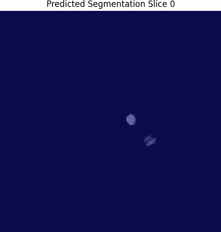
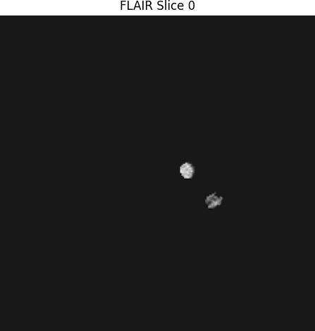

# Introduction

Glioma represents some of the most common and aggressive malignant primary tumors of the central nervous system present in adults. Forming from glial cells within the brain, their difficulty in diagnosis is compounded by their seemingly generic and common symptoms, such as headaches, cognitive changes, weakness in limbs, and vision or speech difficulties which only present in late stages of formation (National Brain Tumor Society, n.d.). Yet, even when symptoms present and MRIs are taken gliomas are misdiagnosed due to their extreme intrinsic heterogeneity in appearance, shape, histology, and inter-observer variability (National Brain Tumor Society, n.d.). As a result of poor methods in diagnosis and prognosis, 48% of all glioma cancers caught and recognized are likewise categorized as glioblastomas, or late stage glioma, requiring immediate and aggressive care through a simultaneous concoction of surgery, radiotherapy, and chemotherapy (Glioblastoma Research Organization, n.d.). However, even then outlook remains bleak, with a median survival period of 12 to 15 months after diagnosis with treatment, and a five year survival rate of only 6.9% (National Brain Tumor Society, n.d.)

# Project

The attached repository aims to provide an avenue of solution by means of computer vision and deep learning. Many obstacles that persist in diagnosing glioblastoma, particularly the characteristics of heterogeneity in appearance, shape, and histology, as well as inter-observer variability, provide a challenge to radiologists and neurologists alike, but are prime for deep learning models. 

# File Navigation

The github repository is broken into 3 folders. The *Coding* folder holds the Google Colab notebook in which code was created, tested and run.
 - **Please Note**: Running the code requires a large amount of computational resources. The following code was tailored to Google Colab resources, specifically A100 GPU Runtimes. 

The *Model* folder contains the saved .keras model trained after 10 epochs.

The *Documents* folder contains all relative documents including gifs and the final report. 

# Dataset

The dataset used here is from the BraTS 2021 Challenge, and is available at the listed resources below or online in a more recent format. It is composed of NIfTI files totaling 140 GB or a truncated 13.4 GB for the Kaggle version used in this project and offered below. 

# Model Architecture

The model used is a 3D U-Net model evolved from common CNNs particularly for 3-Dimensional modeling and segmentation tasks. In this iteration, we have a total of 7 blocks, resulting in approximately 5,600,000 trainable parameters. 

# Results

Overall the results were promising. In the gif, necrotic core of dead tissue at the center of the glioblastoma is shown in red, swelling around the tumor in green, and actively growing portion of the glioblastoma in yellow. The overall cancer is outlined in a red segmentation.

Similarly, the IOU score used to measure overlap between ground truth and predicted segmentation of glioblastoma resulted in approximately 73.80%, which is relatively high considering the constraints. 

## References

Aboud Glioblastoma. (n.d.). Nationa Brain Tumor Society. https://braintumor.org/events/glioblastoma-awareness-day/about-glioblastoma/

Brain Tumor Segmentation. (n.d.). Brain tumor segmentation. http://braintumorsegmentation.org/

Glioblastoma: Diagnosis and treatment. (June 20th, 2024). Mayo Clinic. https://www.mayoclinic.org/diseases-conditions/glioblastoma/diagnosis-treatment/drc-20569078

Kihira, S., Mei, X., Mahmoudi, K., Liu, Z., Dogra, S., Belani, P., Nael, K. (2022). U-Net based segmentation and characterization of gliomas. Cancers, 14(18), 4457. https://doi.org/10.3390/cancers14184457

Liyen, K., Drummond, K., Hunn, H., Williams, D., O'Brien, T., Monif, M. (2020). - Potential biomarkers and challenges in glioma diagnosis, therapy and prognosis. BMJ Neurology Open. https://doi.org/10.1136/bmjno-2020-000069

McKinnon, C. (2021). Glioblastoma: clinical presentation, diagnosis, and management. BMJ, 364(). https://doi.org/10.1136/bmj.n1560

Rafi, A., Ali, J., Akram, T., Fiaz, K., Raza Shahid, A., Raza, B., & Mustafa Madni, T. (2020). U-Net based glioblastoma segmentation with patient’s overall survival prediction. In Intelligent Computing Systems: Third International Symposium, ISICS 2020, 3(), 22-32. https://doi.org/10.1007/978-3-030-43364-2_3

Ronneberger, O., Fischer, P., & Brox, T. (2015). U-net: Convolutional networks for biomedical image segmentation. Medical image computing and computer-assisted intervention–MICCAI 2015: 18th international conference, 3(18), 234-241. https://doi.org/10.48550/arXiv.1505.04597

Schettler, D. (2021). BraTS 2021 Task 1. Kaggle. https://www.kaggle.com/datasets/dschettler8845/brats-2021-task1/data

What is the Average Glioblastoma Survival Rate? (n.d.). Glioblastoma Research Organization. https://www.gbmresearch.org/blog/glioblastoma-survival-rate
